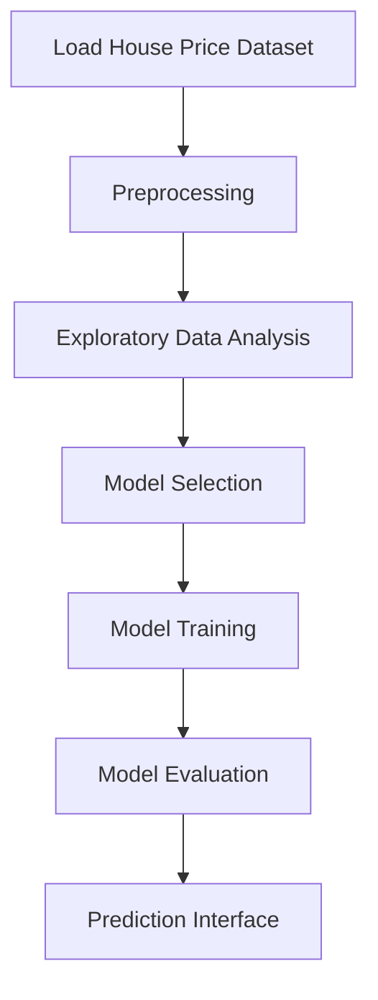

# 🏚️House Price Prediction – AI/ML Intern QSkill
###  Link to access the deployed work: https://house-price-prediction3.streamlit.app/

Welcome to the House Price Prediction project repository! This project implements a machine learning pipeline to predict house prices using various features, leveraging popular Python libraries for data science and machine learning. The codebase is designed for both learning and practical applications in the real estate analytics domain.

## Introduction

House Price Prediction is a classic regression problem widely used as an introductory data science challenge. This repository demonstrates an end-to-end approach to building, training, and evaluating regression models to predict house prices based on historical house sales data. The workflow includes data preprocessing, exploratory data analysis, feature engineering, model selection, training, evaluation, and making predictions on new data.

## Features

- Comprehensive data preprocessing and cleaning pipeline.
- Exploratory Data Analysis (EDA) with visualizations.
- Feature engineering techniques to improve model performance.
- Multiple regression algorithms implemented and compared (e.g., Linear Regression, Random Forest,XGBoost).
- Hyperparameter tuning and model optimization.
- Model evaluation using various metrics.
- Prediction on new, unseen data.
- Modular code structure for easy extensibility.
---
---
## Data Flow Overview

Below is a high-level overview of the data flow and model pipeline:



## Requirements

To run this project, ensure your system has the following:

- Python 3.7+
- pip (Python package manager)

### Python Libraries

- numpy
- pandas
- scikit-learn
- matplotlib
- seaborn
- jupyter (optional, for notebooks)

You can install all dependencies using the provided requirements file.

## Installation

Follow these steps to set up the project locally:

1. **Clone the repository:**
   ```bash
   git clone https://github.com/HariKrishnaKumar-watersprinter/House-Price-Prediction---AI-ML-Intern-QSkill.git
   cd House-Price-Prediction---AI-ML-Intern-QSkill
   ```

2. **Create a virtual environment (recommended):**
   ```bash
   python -m venv venv
   source venv/bin/activate      # On Windows: venv\Scripts\activate
   ```

3. **Install dependencies:**
   ```bash
   pip install -r requirements.txt
   ```

4. **(Optional) Start Jupyter Notebook:**
   ```bash
   jupyter notebook
   ```

## Usage

### 1. Data Preparation

- Place your dataset (CSV file) in the `data` folder.
- Update file paths in the code if your data is located elsewhere.

### 2. Running the Pipeline

- Run the main script to process data, train, and evaluate models:
  ```bash
  python main.py
  ```

- For step-by-step execution and experimentation, open and run the provided Jupyter notebook:
  ```bash
  jupyter notebook notebooks/house_price_prediction.ipynb
  ```

### 3. Making Predictions

- Once trained, use the saved model to predict prices for new houses:
  ```bash
  python predict.py --input new_data.csv --model saved_model.pkl
  ```

- The predicted prices will be output to the terminal or saved as a CSV file, depending on your script setup.

### 4. Results and Outputs

- Model evaluation metrics (MAE, RMSE, R²) will be displayed after training.
- Model artifacts and logs are stored in the `models` and `logs` directories, respectively.
- Visualizations and EDA outputs can be found in the `outputs` or `notebooks` folder.

## Configuration

You can customize the project through configuration files or script parameters:

- **config.yaml**: Adjust model hyperparameters, file paths, and training options.
- **main.py arguments**: Override defaults via command-line arguments.

Key configurable parameters include:

- Data file paths
- Model type and hyperparameters
- Training/test split ratio
- Output locations for models and predictions

Example configuration snippet:

```yaml
data:
  train_file: data/train.csv
  test_file: data/test.csv
model:
  type: RandomForestRegressor
  params:
    n_estimators: 200
    max_depth: 10
    random_state: 42
output:
  model_dir: models/
  results_dir: outputs/
```

## Contributing

We welcome contributions to improve this project! Please follow these guidelines:

- Fork the repository and create your branch from `main`.
- Write clear, concise commit messages.
- Ensure code follows PEP8 standards and includes comments.
- Add tests or notebooks for new features or bug fixes.
- Submit a pull request detailing your changes and the problem addressed.

### How to Contribute

1. **Fork the repository** on GitHub.
2. **Clone your fork** locally:
   ```bash
   git clone https://github.com/your-username/House-Price-Prediction---AI-ML-Intern-QSkill.git
   ```
3. **Create a new branch** for your feature or fix:
   ```bash
   git checkout -b feature-branch
   ```
4. **Make your changes** and commit:
   ```bash
   git add .
   git commit -m "Add new feature"
   ```
5. **Push to your fork** and open a pull request on GitHub:
   ```bash
   git push origin feature-branch
   ```

For major changes, please open an issue first to discuss your proposal.

---

Thank you for your interest in the House Price Prediction project. We hope this repository provides a strong foundation for your journey in applied machine learning and data science!
