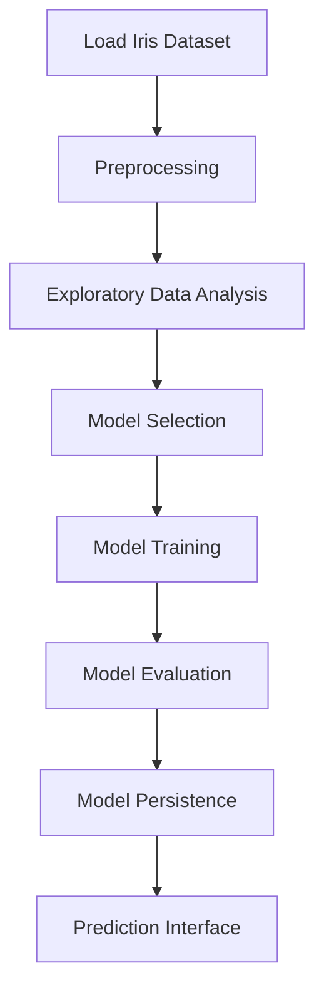

# 🌷 Iris Flower Detection - Qskill AI ML Intern 
###  Link to access the deployed work:https://iris-flower-detections.streamlit.app/

Welcome to the Iris Flower Detection project developed under the Qskill AI ML Internship program. This repository demonstrates a complete machine learning pipeline for classifying Iris flower species, showcasing core skills in data science, machine learning, and Python development.

---

## Introduction

The Iris Flower Detection project utilizes the classic Iris dataset to predict the species of an Iris flower based on its morphological features. The project covers essential steps of the ML workflow—from data loading and exploratory analysis to model training, evaluation, and deployment. This repository is well-suited for beginners and intermediate learners aiming to strengthen their practical ML skills.

---

## Features

- Data loading and preprocessing for the Iris dataset
- Exploratory data analysis with visualization support
- Multiple model training (e.g., Logistic Regression, SVM, Decision Tree)
- Model evaluation and comparison using metrics
- Simple prediction interface for new samples
- Modular Python scripts for maintainability

---
---

## Data Flow Overview

Below is a high-level overview of the data flow and model pipeline:



---
## Requirements

Before setting up the project, ensure you have the following requirements satisfied:

- Python 3.7 or higher
- pip (Python package installer)

#### Python Dependencies

- numpy
- pandas
- matplotlib
- seaborn
- scikit-learn
- joblib (for model persistence)
- Jupyter Notebook (optional, for interactive analysis)

Install all dependencies at once using:
```bash
pip install -r requirements.txt
```

---

## Installation

Follow these instructions to set up the project on your local machine:

1. **Clone the repository:**
   ```bash
   git clone https://github.com/HariKrishnaKumar-watersprinter/Iris-flower-Detection-Qskill-AI-MLIntern.git
   cd Iris-flower-Detection-Qskill-AI-MLIntern
   ```

2. **Install dependencies:**
   ```bash
   pip install -r requirements.txt
   ```

3. **(Optional) Set up a virtual environment:**
   ```bash
   python -m venv venv
   source venv/bin/activate   # On Windows: venv\Scripts\activate
   pip install -r requirements.txt
   ```

---

## Usage

You can run the main workflow from the command line or interactively using Jupyter Notebook.

### Running from the Command Line

1. **Train the model:**
   ```bash
   python iris_ml_pipeline.py
   ```

2. **Predict new samples:**
   - Edit the `predict.py` script with your input data or use the provided interface.
   - Run:
     ```bash
     python predict.py
     ```

3. **View results:**
   - Check the output in your terminal or the generated files (e.g., logs, model binaries).

### Interactive Analysis

- Open the included Jupyter Notebooks to explore data, train models, and visualize results step-by-step.
  ```bash
  jupyter notebook Iris_Flower_Detection_Qskill.ipynb
  ```

---

## Configuration

You can configure the project's behavior via environment variables or by editing the configuration sections in scripts.

- **Data file location:** Edit the path in `iris_ml_pipeline.py` if using a custom dataset.
- **Model persistence:** Change the model save/load path in the respective scripts.
- **Hyperparameters:** Modify model parameters (e.g., test size, random state, algorithm settings) in the script or via a config file.

Example (inside `iris_ml_pipeline.py`):
```python
TEST_SIZE = 0.2
RANDOM_STATE = 42
MODEL_TYPE = 'logistic_regression'  # Options: 'svm', 'decision_tree'
```

---

## Contributing

We welcome contributions to enhance the functionality, add new models, or improve documentation.

- Fork the repository.
- Create a new branch for your feature or fix.
- Make your changes with clear commit messages.
- Ensure code style matches PEP8 guidelines.
- Submit a pull request with a detailed description.

#### Contribution guidelines

- Keep code modular and well-documented.
- Add or update tests for new features.
- Update the README if your change affects the workflow or usage.

---

## Project Structure

```plaintext
Iris-flower-Detection-Qskill-AI-MLIntern/
├── data/
│   └── iris.csv
├── notebooks/
│   └── Iris_Flower_Detection_Qskill.ipynb
├── iris_ml_pipeline.py
├── predict.py
├── requirements.txt
├── README.md
└── models/
    └── trained_model.joblib
```

---

```
## Contact

For questions or collaboration, please open an issue or contact the repository maintainer via GitHub.

---

Thank you for exploring the Iris Flower Detection project!
